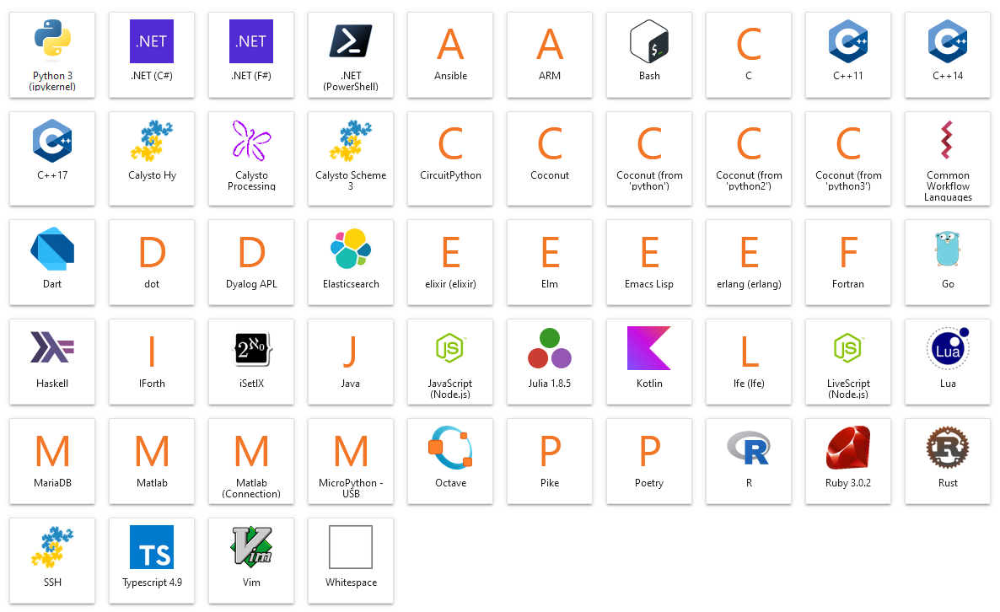

# Ultra-Jupyter

Ultra-Jupyter is a pre-configured version of [JupyterHub](https://jupyter.org/hub) with a custom notebook image that is pre-filled with several kernels, providing a boilerplate setup for easy deployment.

## Features
- Pre-installed kernels for multiple programming languages including:
  - Python3
  - .NET (C# / F#)
  - Java
  - Rust
  - Go
  - Matlab
  - Pike 
  - Lua
  - Kotlin
  - C / C++ (11, 14, 17)
  - Javascript
  - Typescript (4.9)
  - Bash
  - MySQL (MariaDB)
  - Ruby
  - Scala
  - Zsh
  - Julia
  - R
  - Octave
  - Lisp (Emacs)
  - Elm
  - Erlang
  - Elixir
  - LFE
  - Whitespace
  - Dart
  - VimScript
  - SSH
  - Haskell
  - LiveScript
  - Coconut (Python)
  - MicroPython
  - Calysto Hy
  - Calysto Processing
  - Calysto Scheme 3
  - SetlX
  - Dyalog APL
  - Ansible 




## Installation

### Prerequisites

- [Docker](https://www.docker.com/)
- [Docker Compose](https://docs.docker.com/compose/) (optional, for easier management)

Due to having so many language based dependencies, the Ultra-Jupyter-Notebook image equals over 15GB of storage. If you 
plan on having many users on a server, keep note that each user will have
their own notebook container. 

### Steps

Clone this repository, run the install script, then `docker-compose up`.

```bash
git clone https://github.com/starhound/ultra-jupyter
cd ultra-jupyter
sudo ./install.sh
sudo docker-compose up
```
The install script simply ensures docker is installed and pulls the two container images. 

## Usage

After running `docker-compose up`, you can access the JupyterHub interface at `http://localhost:8005`. By default, dummy authorization is configured for `admin` with a password of `admin`. You can change this by modifying the `jupyterhub_config.py` file to fit your configuration needs. More
information about authorization can be found [here](https://jupyterhub.readthedocs.io/en/stable/reference/authenticators.html).

### Ultra-Jupyter-Notebook

If you only want the notebook functionality, you can skip JupyterHub and 
just utilize the notebook with: 

```
docker run -d -p 8888:8888 --name ultra-jupyter-notebook \
  -v /path/to/your/notebooks:/home/jovyan/work \
  starhound/ultra-jupyter-notebook
```

Leave out the volume if you have no existing notebooks to bring in.

## Contributing 

See your favorite kernel missing? Please reach out, or submit a PR!

To add a language and kernel, you will need to modify and build the Dockerfile in the user-notebook directory. This image takes a very long time to build, but caching makes it faster. Happy to take any advice on how to improve the build process.

## TODO 

- Add more kernels
- An install script that lets you choose which kernels to install
- Polyglot notebooks
- Fortran / PHP / Scala / Swift / Racket / Prolog / COBOL /

## Credits

This project is built atop the work of dozens of contributors to the Jupyter ecosystem and the creators of the various programming languages.

Some notable projects that were used:
- [jupter-elm-kernel](https://github.com/abingham/jupyter-elm-kernel)
- [dyalog-jupyter-kernel](https://github.com/Dyalog/dyalog-jupyter-kernel)
- [ssh-kernel](https://github.com/NII-cloud-operation/sshkernel)
- [bash_kernel](https://github.com/takluyver/bash_kernel)
- [dotnet-interactive](https://github.com/dotnet/interactive/)
- [IHaskell](https://github.com/IHaskell/IHaskell)
- [IJava](https://github.com/SpencerPark/IJava)
- [kotlin-jupyter](https://github.com/Kotlin/kotlin-jupyter)
- [iula](https://github.com/guysv/ilua)
- [matlab_kernel](https://github.com/calysto/matlab_kernel)
- [ijavascript](https://github.com/n-riesco/ijavascript)
- [jupyter-pike-kernel](https://github.com/kevinior/jupyter-pike-kernel)
- [calysto_hy](https://github.com/Calysto/calysto_hy)
- [coconut](http://coconut-lang.org/)
- [itypescript](https://github.com/winnekes/itypescript)
- [vim_kernel](https://github.com/mattn/vim_kernel)
- [isetlX](https://github.com/1b15/iSetlX)
- [calysto_scheme](https://github.com/Calysto/calysto_scheme)
- [almond](https://github.com/almond-sh/almond)

many many more...